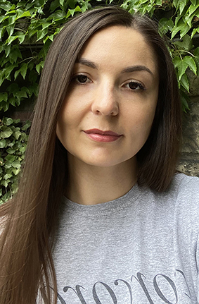

### Personal info:

---

## Karina Vodianytska



### Contact information:

- E-mail: vodyanitskaya.karina.dev@gmail.com

- GitHub: [Karina-Vodianytska](https://github.com/Karina-Vodianytska)

- Phone: +48 572 010 991

- Nationality: Ukrainian

- Date of birth: March 11, 1991

---

### Education:

- European School of Social Integration TERRA NOVA 2023 - 2024

- Specialty: Medical Sterilization Technician

---

### About me:

I am deeply passionate about what I do and constantly strive to ensure that each project reaches its full potential. With an eye for detail, I contribute effectively to team efforts and achieve results. I’m interested in Web Development because this occupation provides endless possibilities for professional growth, besides there’s a huge amount of free high quality resources for self-education and a large community of developers.

---

### Language:

- English (A2)
- Russian Native
- Ukrainian Native
- Polish (A1)

---

### Skills:

- HTML
- CSS
- Figma
- JS
- Git
- VS Code

---

### Code Example:

```
const zeroFuel = (distanceToPump, milesPerGallon, gallonsLeft) => {
   return milesPerGallon * gallonsLeft >= distanceToPump;
 };
 console.log(zeroFuel(50, 25, 2));

```
